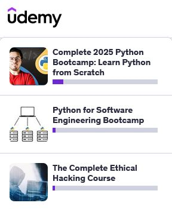

Hello, and thanks for peering into my brain as I code things.
At the moment I experiment with Python and SQL, but have dabbled
in many languages in the past to include HTML, Javascript, C++,
and C# (mainly because of the Unreal and Unity gaming engines).
Like most, I am not a master of any because we are always learning
more and our brains can only house so much. However, when faced
with a task or project, I can get the job done utilizing the many
tools we have available to us from Github, web searches, or AI
assistance. 

So let's get started with altering this webpage a bit from the
default Jekyll template.

* * *

### My Humble Homage

We all had to start somewhere so here is my homage...

```html
// HTML
<!DOCTYPE html>
<html>
   <body>
      <p>Hello World!<p>
   </body>
</html>
```

```python
# Python
print("Hello World!")
```

```C\#
# C#
public class Program
{
    public static void Main(string[] args)
    {
        System.Console.WriteLine("Hello, World!");
    }
}
```

```SQL

#SQL but not really SQL, but you get the idea

| UserID  | Name             | Status   |
|:--------|:-----------------|:---------|
| 001     | Edward Donne     | unknown  |
| 003     | Johanna Harwood  | alive    |
| 005     | Stuart Thomas    | dead     |
| 007     | James Bond       | alive    |
```

* * *

### Degrees/Certification I'm working towards:

*   Master's Degree in Cybersecurity (2 classes left)
*   CompTIA Security+
*   CompTIA Network+
*   CompTIA PenTest+

* * *

### Current Online Courses:



* * *

[Link to another page](./another-page.md).

* * *

```
You have reached the end of my brain-dump.
```
